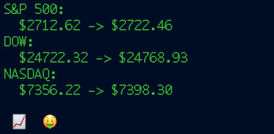
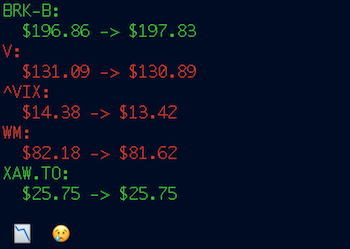
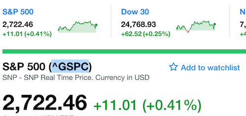

# hows-the-market

A totally professional, stylish, sophisticated and generally badass tool for checking in on the market from your command line.

## Install

Installation from source requires a working Go environment:

``` 
$ go get -u github.com/KyleBanks/hows-the-market
```

## Usage

There's not a whole lot to it, just run `hows-the-market` to see your fate:

```
$ hows-the-market
```



Of course, you can also use `--help` to display usage information.

### Custom Symbols

By default, `hows-the-market` uses the S&P 500, DOW and NASDAQ to measure your fortunes. If you prefer to use your own symbols ([and you probably should](https://www.investopedia.com/articles/investing/010917/opinion-dow-stupid.asp)), feel free to do so using the `--symbols` argument:

```
$ hows-the-market --symbols BRK-B,V,^VIX,WM,XAW.TO  
```



**Note**: `hows-the-market` uses [Yahoo! Finance](https://finance.yahoo.com) under-the-hood, so you'll need to make sure your symbols are consistent with theirs. For most US stocks the symbol is exactly what you'd expect, however for indices and OTC stocks you'll want to grab the symbol from the Yahoo! URL or beside the name like so:



### Other Options

`--percent`:

Using the `--percent` flag will display the percentage increase/decrease of each symbol during the current trading period.

```
$ hows-the-market --percent
S&P 500:
  $2719.71 -> $2729.09 (0.34%)
DOW:
  $24752.40 -> $24803.78 (0.21%)
NASDAQ:
  $7379.58 -> $7417.22 (0.51%)

 📈  🤑 
```

`--time`:

Using the `--time` flag will display the market time when prices were last loaded, which is usually the current time for US stocks and up to twenty minutes delayed for OTC during market hours:

```
$ hows-the-market --time --symbols SHOP.TO,NTDOY,V
SHOP.TO:
  $182.00 -> $185.05 
  Jan 2, 2018 at 9:33:40am EDT
NTDOY:
  $52.41 -> $52.59 
  Jan 2, 2018 at 9:38:36am EDT
V:
  $130.58 -> $130.52 
  Jan 2, 2018 at 9:48:09am EDT

 📈  😂 
```

## Disclaimer

`hows-the-market` uses the Yahoo! Finance API, which is known to be unstable with breaking changes introduced without notice, and is not officially supported for external use, so use at your own risk. Oh, it's likely also against their Terms of Service, so consider yourself warned.

## License

`hows-the-market` is made available under the [MIT License](./LICENSE).
